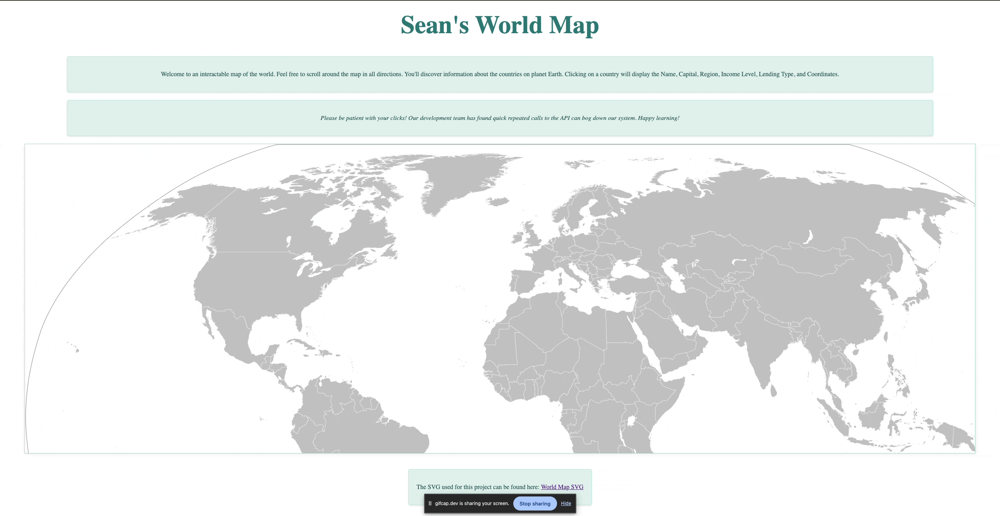

# Seans World Map

This MVP website was built to provided specifications for my college course D280.
I was not allowed to use frameworks.

# _JavaScript Programming_

This project was generated with [Angular CLI](https://github.com/angular/angular-cli) version 17.3.2.

#### By _**Sean Keane**_

#### WGU Code Review 03/30/2024

## Technologies Used

* HTML
* CSS
* TypeScript
* Angular

## Description
_This is a project I created for my B.S. in Software Engineering that takes an SVG of a world map and displays relevant information based on user clicks.  It is a single page application with the map centered on the page.   Clicking on a country will display the Name, Capital, Region, Income Level, Lending Type, and Coordinates.  Developing this application helped me grow my understanding of TypeScript, Angular, HTML, and CSS._

## Setup/Installation Requirements

1) Clone this repository to your desktop.
2) Navigate to the now installed directory and open in your editor of choice.
3) Open the directory and `cd to seans-world-map`.
4) Run `ng serve` for a dev server. 
5) Open your browser of choice and navigate to `http://localhost:4200/`. The application will automatically reload if you change any of the source files.

## For a visual representation of setup and a successfully built application, please consult the attached Gif.

## Project can be found at:
https://github.com/CanadianRunner/World-Map

## Known Bugs

* No known bugs.

## License

If you have any questions or concerns, feel free to contact me at code@sean-keane.com

## SVG World Map Used:

* https://en.m.wikipedia.org/wiki/File:BlankMap-World.svg

*This is licensed under the MIT license*

Copyright (c) 02-14-2022 **_Sean Keane_**
